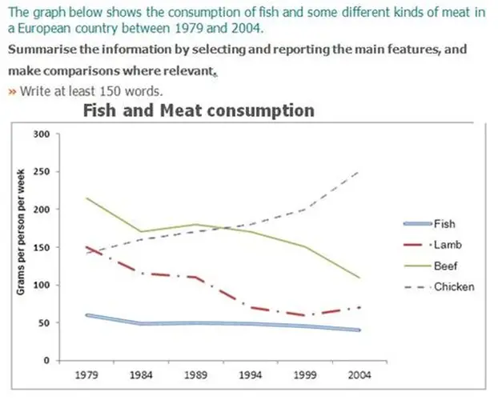

# Writing

## Task 1

| 题型 | 自然段 | |
| --- | --- | --- |
| | 思路 | 示例  |
| 动态图 （2，3，4个时间点）  | 改写题目 + 原则：全部都改（不缺少题目信息量），能改就改 + 方法：     - <u>shows现在时，后面都是过去时</u>     - 扩词     - 换词     - 换句式     - 时间delta | + The graph  -> The line graph + below  -> ~~below~~  + shows -> illustrates/describes/indicates/gives information about + average carbon dioxide (CO2) emissions  -> (how much/changes in the amounts of不可数/number of可数) carbon dioxide **was(名词改动词的时候考虑语态，被排放)** emitted   + per person -> per capita/by every person + in the United Kingdom, Sweden, Italy and Portugal ->in ~~the~~ Great Britain + between 1967 and 2007. -> during four decades from 1967 and 2007 |
| | 概况 + 总体趋势     - Scope: 所有线的     - Point: 只看首尾，即使中间有幅度变化，但因为是概括，所以忽略 + 最突出的排序     - 不好写的不写     - 不能出现数字，因为是概况 | Overall, + the graph shows the consumption of chicken increased daramtically while the popularity of these other foods decreased over the period~~s~~. It is obvious that the consumption of fish remained the least/largest. |
| | Body 1/2 Scope: 所有线的细节 table followed | 怎么说起点排序？按大小顺序描述 In 1979, + beef was the most popular of these foods, with about 225 grams consumed per person per week + Lamb and chicken were eaten in similar quantities (around 150 grams), while much less fish was consumed (just over 50 grams).  Body 1 下降的一组 + 起终点，5种句型  During this 25-year period,  + 两组一起说the consumption of beef and lamb fell dramatically to approximately 100 grams and 55 grams respectively/each. + The consumption of fish also declined gradually to 50 gram. + 最少的 It remained the least popular food, + 最平缓 and the consumption levels were the most stable.  Body 2 - 上升的一组 + 交点，The consumption of chichek, on the other hand, increased significantly, overtaking that of lamb in 1980 and that of beef in 1989, at around 145 grams and about 200 grams respectively. + By 2024, it had soared to almost 250 grams per person per week. **(by now, have done; by previous year, had done)** |
| 静态图 （0，1个时间点） | 概括 + Scope: 跨列 + Point: 最值分布规律 | |
| | Body + Scope: 每一列 + Point     - 最大/次大     - 最小     - 对比 1~2次         * 很近： 相似 - similar         * 不近不远：区间         * 很远：倍数 | |

| Point: 点 | 变化 | 词汇 | | 数值 | 句型 |
| --- | --- | --- | --- | --- | --- |
| | | v/v-pass/n <u>主动语态，过去式</u> | adv | prep 写具体数字，<u>加单位</u> 具体数字后面的数词不加s 120 million/thousand |  |
| 起点到终点 | 上升 | + 一般上升     - increase/increased/-     - climb/climbed/-     - rise/**rose**/-     - ~~raise hand~~     - grow/**grew**/**growth**     - go up/went up/x + 剧烈上升     - surge/surged/-     - soar/soared/-     - rocket/rocketed/x | + 剧烈地     - sharply/rapidly/significantlydramatic**ally/**drastic**ally** + 缓慢地     - slightly/modestly/moderately/marginally/ + (上升/下降)持续地     - gradually/continuously | from num to num | 单阶段 + TITLE dropped gradually by DELTA + [v ->n] TITLE had/experienced a gradual drop of DELTA + [There be，主语后置] There was a gradual drop of DELTA in TITLE. + [宾语前置被动语态，主语后置] A gradual drop of DELTA could be found in TITLE. + [增加时间主语，主语后置]The four decades witnessed a gradual drop of DELTA in TITLE.  |
| | 下降 | + 一般下降     - decrease/decreased/-     - drop/dropped/-     - fall/**fell**/-     - decline/declined/-     - go down/went down/-     - dwindle/dwindled/**dwindlement** + 剧烈下降     - plunge/-ed/-     - plummet/-ed/-     - slump/-ed/-     - tumble/-ed/- | | | |
| | 不变 | + remain/stay/keep+stable; remained/stayed/kept+stable; x + **stabilise**/stabilised/x + level off/levelled off/x | x | at num | |
| | 波动 | + experience rises and falls/experienced/x + fluctuate/fluctuated/fluctuation | dramatially/widly slightly/moderately |  | 多阶段 + TITLE grew to a peak but then slumped to + TITLE grew to a peak before slumping to  + [After引导，主语后置] After growing to a peak, TITLE slumped to + [增加时间主语，主语后置]The first decade witnessed a growth to a peak, followed by a 30-year period of all in TITLE.  **30-year不加s** |
| 极值(peak/bottom) | 到达（最值） | + reach the peak/bottom; reached; x + arrive at the peak/bottom; arrived; x | x | at num | |
| 交点 | 动作 | + 超过     - surpass/supassed/x     - overtake/overtook/x     - outnumber/outnumbered/x     - ~~**exceed**~~ + 相等be the same as/with, equals to  |  | at num | |

