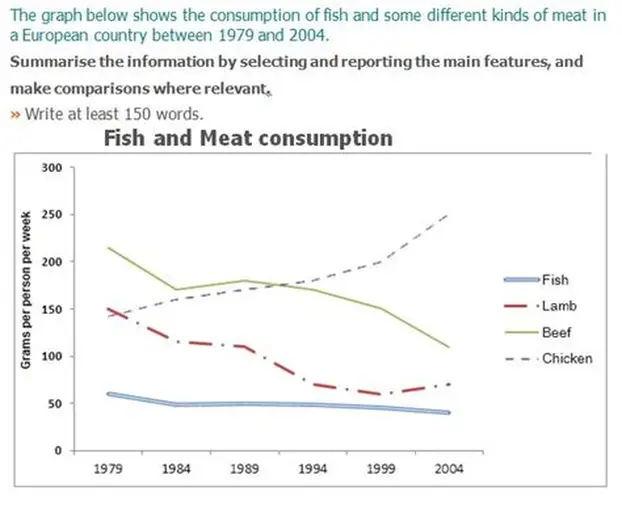

# Writing

## Task 1

| 题型 | 自然段 | |
| --- | --- | --- |
| | 思路 | 示例  |
| 动态图 （2，3，4个时间点）  | 改写题目 + 原则：全部都改（不缺少题目信息量），能改就改 + 方法：     - <u>shows现在时，后面都是过去时</u>     - 扩词     - 换词     - 换句式     - 时间delta | + The graph  -> The line graph + below  -> ~~below~~  + shows -> illustrates/describes/indicates/gives information about + average carbon dioxide (CO2) emissions  -> (how much/changes in the amounts of不可数/number of可数) carbon dioxide **was(名词改动词的时候考虑语态，被排放)** emitted   + per person -> per capita/by every person + in the United Kingdom, Sweden, Italy and Portugal ->in ~~the~~ Great Britain + between 1967 and 2007. -> during four decades from 1967 and 2007 |
| | 概况 + 总体趋势     - Scope: 所有线的     - Point: 只看首尾，即使中间有幅度变化，但因为是概括，所以忽略 + 最突出的排序     - 不好写的不写     - 不能出现数字，因为是概况 | Overall, + the graph shows the consumption of chicken increased daramtically while the popularity of these other foods decreased over the period~~s~~. It is obvious that the consumption of fish remained the least/largest. |
| | Body 1/2 Scope: 所有线的细节 table followed | 怎么说起点排序？按大小顺序描述 In 1979, + beef was the most popular of these foods, with about 225 grams consumed per person per week + Lamb and chicken were eaten in similar quantities (around 150 grams), while much less fish was consumed (just over 50 grams).  Body 1 下降的一组 + 起终点，5种句型  During this 25-year period,  + 两组一起说the consumption of beef and lamb fell dramatically to approximately 100 grams and 55 grams respectively/each. + The consumption of fish also declined gradually to 50 gram. + 最少的 It remained the least popular food, + 最平缓 and the consumption levels were the most stable.  Body 2 - 上升的一组 + 交点，The consumption of chichek, on the other hand, increased significantly, overtaking that of lamb in 1980 and that of beef in 1989, at around 145 grams and about 200 grams respectively. + By 2024, it had soared to almost 250 grams per person per week. **(by now, have done; by previous year, had done)** |
| 静态图 （0，1个时间点） | 概括 + Scope: 跨列 + Point: 最值分布规律 | |
| | Body + Scope: 每一列 + Point     - 最大/次大     - 最小     - 对比 1~2次         * 很近： 相似 - similar         * 不近不远：区间         * 很远：倍数 | |

| Point: 点 | 变化 | 词汇 | | 数值 | 句型 |
| --- | --- | --- | --- | --- | --- |
| | | v/v-pass/n <u>主动语态，过去式</u> | adv | prep 写具体数字，<u>加单位</u> 具体数字后面的数词不加s 120 million/thousand |  |
| 起点到终点 | 上升 | + 一般上升     - increase/increased/-     - climb/climbed/-     - rise/**rose**/-     - ~~raise hand~~     - grow/**grew**/**growth**     - go up/went up/x + 剧烈上升     - surge/surged/-     - soar/soared/-     - rocket/rocketed/x | + 剧烈地     - sharply/rapidly/significantlydramatic**ally/**drastic**ally** + 缓慢地     - slightly/modestly/moderately/marginally/ + (上升/下降)持续地     - gradually/continuously | from num to num | 单阶段 + TITLE dropped gradually by DELTA + [v ->n] TITLE had/experienced a gradual drop of DELTA + [There be，主语后置] There was a gradual drop of DELTA in TITLE. + [宾语前置被动语态，主语后置] A gradual drop of DELTA could be found in TITLE. + [增加时间主语，主语后置]The four decades witnessed a gradual drop of DELTA in TITLE.  |
| | 下降 | + 一般下降     - decrease/decreased/-     - drop/dropped/-     - fall/**fell**/-     - decline/declined/-     - go down/went down/-     - dwindle/dwindled/**dwindlement** + 剧烈下降     - plunge/-ed/-     - plummet/-ed/-     - slump/-ed/-     - tumble/-ed/- | | | |
| | 不变 | + remain/stay/keep+stable; remained/stayed/kept+stable; x + **stabilise**/stabilised/x + level off/levelled off/x | x | at num | |
| | 波动 | + experience rises and falls/experienced/x + fluctuate/fluctuated/fluctuation | dramatially/widly slightly/moderately |  | 多阶段 + TITLE grew to a peak but then slumped to + TITLE grew to a peak before slumping to  + [After引导，主语后置] After growing to a peak, TITLE slumped to + [增加时间主语，主语后置]The first decade witnessed a growth to a peak, followed by a 30-year period of all in TITLE.  **30-year不加s** |
| 极值(peak/bottom) | 到达（最值） | + reach the peak/bottom; reached; x + arrive at the peak/bottom; arrived; x | x | at num | |
| 交点 | 动作 | + 超过     - surpass/supassed/x     - overtake/overtook/x     - outnumber/outnumbered/x     - ~~**exceed**~~ + 相等be the same as/with, equals to  |  | at num | |

# Reading
## Vocabulary

### 没见过
#### 难记（干）
- re重复+percussion n打击乐器
- repercussion n(不好的)持续影响
- 
- stroll vn漫步=wander
- 
- contingent adj依情况而定的 be contingent on
- 
- rig n成套器械，船桅 v操纵，垄断
- trig外表整洁的  
- trigger n触发器,扳机,起因 v引发

#### 次难记（带有特征）
- chamber n洞穴,室
- compartment n隔间
- 
- loom v（尤指阴森森地）隐约出现, 逼近，临近
- looming adj（不希望或不愉快的事情）迫近的，逼近的
- 
- martial 军事的 martial music军乐 martial arts武术 - march v行军  - Mars战神
- 
- squanderer n. 放荡者
- squander vn浪费
- 
- stunning adj极其漂亮的
- 
- solitary孤独的 gourme**t** / ˈɡʊrmeɪ /美食家

#### 不发音
- id**y**ll /ˈaɪdl/=idol n田园诗  - 爱豆idol喜欢田园诗idyll
- idyllic /aɪˈdɪlɪk/ adj田园的，闲适的 
- r**h**etoric n修辞，华而不实的言语
- hygi**e**n**e** n卫生
- hygi**e**nic adj卫生的，保健的
- forf**e**it /ˈfɔːrfɪt/ v丧失 nf罚金 - feit=fect做
- fortress /ˈfɔːrtrəs/ n.堡垒；要塞 vt.筑要塞
- equity /ˈekwəti/ 公平

#### 好联想记忆
- devle v钻研 - 在书架shelves里钻研delve
- buckle nv扣紧 - 把雄鹿buck扣紧buckle
- venerate v崇敬 - 产生generate崇敬venerate
- triumph nv胜利 - 吹喇叭trump庆祝胜利triumph
- regent /ˈriːdʒənt/ 统治者 - reg国王 - Regent Hotel 丽晶酒店,统治者酒店
- aliment n滋补品 v滋养 <- 阿里滋养人
- whim n心血来潮 - 谁whom有念头whim
- abject adj凄惨绝望的  abject poverty穷困潦倒 - 被拒绝reject很绝望abject
- entangle v使纠缠 - nv探戈舞tango nv缠结tangle在一起
- secrete v（动植物或其细胞）分泌；隐藏，藏匿（小物件） - 将秘密secret隐藏起来secrete
- devoid 全无的 - de加强+void空 避免avoid全无的devoid
- strand n岸，滨 v搁浅 n（绳、线、毛发等的）股，缕 站在stand岸边strand
- stranding n搁浅 

### 部分熟悉
#### 直观意思理解容易偏差，理解错 
- desirable adj值得拥有的; 值得做的 - 不是想要的
- 
- impart v传授，给予 - 把自己的一部分part给出去，不是分割的 impart knowledge 
- impartial公正的，不偏不倚的
- 
- physician n内科医生 - 不是物理学家physicist /ˈfɪzɪsɪst/
- surgeon n外科医生 - 外科医生surgon的数量迅速增长burgeon
- burgeon n嫩枝 v发芽；迅速增长

- easy-going adj平易近人的 - 不是来的容易
- Time always easy come easy go.时间总是来的容易去的快
- 
- entrench v使根深蒂固 - 不是拉伸stretch - trench nv战壕 - en进入+trench战壕
- 
- erratic adj飘忽不定的 n漂泊无定的人，古怪的人；（地质）漂块 - err 漫游 - 不是错误的
- 
- wicked adj邪恶的 - 不是女巫witch
- 
- spontaneous adj自发的 - 不是sponge nv海绵块

#### 记混
- company vn陪伴
- companion n同伴
- 
- 精英elite避开elude诱惑v. elicit
- elite n精英，adj出类拔萃的
- elude v避开
- elicit v引出诱出=tempt
- temptation n诱惑
- 
- 
- immigration n入境，移民
- emigration n出境，移民
- 
- observatory 天文台 - observe观察
- conservatory n温室 - conserve保存
- 
- conspicious adj显眼的 -  con加强+spic看
- suspicious adj可疑的 - sus由上往下+spic看
- 
- commute nv通勤
- communal adj公共的=collective
- 
- genius天才
- ingenious巧妙的 
- 
- retention n.保持，保留
- contend v主张   主张contend什么内容content
- proposition n主张  preposition n介词，前置词

#### 熟悉加前后缀，不完全准确
- apace adv快速地 -  a-加强
- the Commonweath 英联邦
- dismantle v拆除，取消  - mantle 地幔
- subliminal adj下意识潜意识的 - sub下+limin=limen最小的
- aboriginal adj土著的 - ab加强+original最初的  abrigional culture土著文化
- dissonant adj刺耳的 - dis不+son声音
- overrun vn泛滥，超过

- ex**cav**ate v挖掘 - cav洞
- e**radic**ate v根除 eradicate famine消除饥饿
- radical adj根本的 [极端的 n极端分子]

- custom n习惯
- customs n海关
- customer n顾客
- accustom v使习惯
- accustomized adj习惯的 - get accustomized to
- ac**climat**ize v使习惯 - ac+climate+ize  acclimatize onself to
- 
- audit nv审计
- auditorial adj审计的
- auditory adj听觉的
- 
- bully v霸凌 n霸凌者
- bullying n霸凌行为  
- 
- ingest v咽下，吸收 - gest带来
- digest v消化，领悟
- uptake n摄取；领会 oxygen uptake摄氧量
- 
- furbish v擦亮
- refurbish v翻新
- 
- remnant n剩余物，遗迹=remain(s) adj剩余的=remaining - remn留下+ant物
-
- opt v选择  opt for
- apt adj易于的 be apt to 易于
- adept /əˈdept/adj n行家 adj精通的be adept at - 不是无能的 
- veteran n老手，退伍军人 adj经验丰富的
- liable adj有责任的，[易于的 be liable to 易于xxx]
- liability n责任 [麻烦的人事，累赘]
- 
- sweeping adj彻底的，范围广的 a sweeping reinvention彻底的重塑

### 多样性
#### 一词多义
- yield - nv产生 [v屈服放弃yield to]
- fair - adj/adv公平的，[合理的=rational n展销会]
- rational 合理的，理性的 rational determination合理判断
- rationale n根本原因，基本原理
- clip - [v夹，剪 n夹子/回形针，剪报/电影片段]
- periodical adj周期的，[n期刊=journal=magzine]
- resort n度假区 [nv求助诉诸 - 报告report上级，紧急求助resort]
- prompt n提示 [adj迅速的 v促使]
- sway nv摇摆 [nv影响 under the sway of 受xxx的影响]
- stray v迷路，走神，离题 n迷路的 stray away偏离
- underlie v位于之下 [v成为基础]
- virtual adj虚拟的，[事实上的virutally]
- dictate v口述 [v规定，支配 n规定命令] dictate price定价
- marvel n奇迹 [v感到惊异marvel at] - marvelous了不起的；非凡的
- spectacle n奇观
- mo‘tif n主旨 [装饰图案=totem图腾]animal motif
- prospect n前景 [v勘探]
- regard v视为 [n关心 in this regard=with regard to在这一方面]
- surrender vn投降，[放弃交出] surrender individual properties上交个人财产
- stubborn adj固执的，[（事）顽固的 stubborn question顽固的问题]

#### 词性
- lack nv缺乏
- mimic v模仿,adj模仿的，n小丑
- means n方法 - be a means of doing, by means of, by no means绝不 by any means无论如何

#### 搭配
- argue nv辩论
  - argue about/over 就xxx辩论 
  - argue for 赞成要求xxx，为xxx辩论
  - arguo sb into/out of doing 说服某人做/不做某事
- bet nv打赌
  - bet with sb on sth

### 话题
#### 法律
- statue /ˈstætʃuː / n雕像
- statute/ ˈstætʃuːt/ n法令
- statutory /ˈstætʃətɔːri/adj法定的
- prosecute v控告 - pro向前+sec跟随
- convict v定罪 n囚犯  convict of证明有罪
- convince v说服

#### 时间
- mortal adj终有一死的，不能永生的 n凡人
- moral n道德
- morale /məˈræl/ n士气，精神面貌 - raise morale提升士气
- immortal adj永垂不朽的 
- eternal adj永恒的 - 外部external是有恒的eternal诱惑
- temporary 暂时的
- chronic ad疾病慢性的，积习难改的 - 不是时间的
- chronological adj按时间顺序的 - 按时间学科的